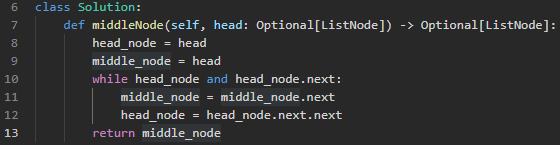

# Daily Leetcode

## Holiday Break - I will post more problems soon!

## 867 Middle of Linked List: 12/8/2022

### Problem

Given the `head` of a singly linked list, *return the middle node of the linked list*.

If there are two middle nodes, return **the second middle** node.

### Assumptions

- I can use two pointers to keep track of the middle and the last node in the linked list.
- If the head pointer is two steps ahead of the middle pointer, the middle pointer will always be halfway through the linked list.

### Optimizations

Solution is:

- O(n) time: The use of a while loop makes this algorithm scale linearly with the input.
- O(1) space: The algorithm did not require extra space in its solution therefore uses constant space.

### Notes

I learned today that the algorithm I used is called the Tortoise and the Hare algorithm where one pointer is faster than the other.

## 206 Reverse Linked List: 12/5/2022

### Problem

Given the `head` of a singly linked list, reverse the list, and *return the reversed list*.

### Assumptions

- Using a while loop allows me to traverse a linked list without knowing its length and without recursion

### Optimizations

Solution is:

- O(n) time: The use of a while loop makes this algorithm scale linearly with the input.
- O(1) space: The algorithm did not require extra space in its solution therefore uses constant space.

### Notes

At first, I considered recursion since it seemed like the "easiest" way to traverse the linked list. But since my base case was always reached `None` at the last node's `next`, I realized that a while loop would work just as well and look cleaner.
Whenever I traverse linked lists with recursion, it's handled in a way I can't fully understand. In my head I know what is happening, but thinking computationally it doesn't add up. With this implementation, I am able to really visualize the traversal and reversal of nodes.

## 21 Merged Two Sorted Lists: 11/30/22

### Problem

You are given the heads of two sorted linked lists `list1` and `list2`.

Merge the two lists in a one **sorted** list. The list should be made by splicing together the nodes of the first two lists.

Return the *head of the merged linked list*.

### Assumptions

- The nodes in each linked list is already sorted, so I will not have to implement any sorts beforehand.

### Optimizations

Solution is:

- O(n) time: Although the comparisons are constant time, accessing each node one by one through recursion makes this algorithm scale linearly with the input.
- O(1) space: The algorithm did not require extra space in its solution therefore uses constant space.

### Notes

...I do not like recursion........ Also, the problem statement was worded a bit strange. As the problem requested that the *head* of the linked list be returned, but instead I returned the linked list in entirety.

## 392 - Is Subsequence: 11/29/2022

### Problem

Given two strings `s` and `t`, return `true` if `s` *is a **subsequence** of* `t`, or `false` *otherwise*.

A **subsequence** of a string is a new string that is formed from the original string by deleting some (can be none) of the characters without disturbing the relative positions of the remaining characters. (i.e., `"ace"` is a subsequence of `"abcde"` while `"aec"` is not).

### Assumptions

- One way to track elements in a collection, ensuring they are removed in order, is a stack.
- If elements are not removed in order, the end of the compared string `t` will be reached with elements remaining in the stack.

### Optimizations

Solution is:

- O(n) time: The compared string must be traversed therefore the runtime scales linearly with the input.
- O(1) space: The size of the data structure used for the algorithm is only as big as `s`. `s` is known at runtime, therefore the data structure does not scale up.

### Notes

Since my mind saw the problem and immediately thought "a stack would solve this...", I did not think about using a separate variable `index` to check each character in `s`.
Both solutions essentially work the same. The stack will pop off a character if found, and the index will increment to the next character in `s`.

I do think that the stack, in theory, is more efficient. As `s` grows, the stack will actually get *smaller*; while with index the number will continue to increase.

## 205 - Isomorphic Strings: 11/28/2022

### Problem

Given two strings `s` and `t`, *determine if they are isomorphic.*

Two strings `s` and `t` are isomorphic if the characters in `s` can be replaced to get `t`.

All occurrences of a character must be replaced with another character while preserving the order of characters. No two characters may map to the same character, but a character may map to itself.

### Assumptions

- One easy way to pair two values is to store them in a hash map with the first string's characters as the keys and the second string's characters as the
  values.
- Hash maps do not allow duplicates meaning the keys can only map to the values found on the first occurrence.

### Optimizations

Solution is:

- O(n) time: The string must be traversed therefore the runtime scales linearly with the input.
- O(n) space: A hash map is created and will also scale linearly with the size of the input.
## 1 - Two Sum: 11/22/2022

### Problem

Given an array of integers `nums` and an integer `target`, _return indices of the two numbers such that they add up to_ target.

You may assume that each input would have **exactly one solution**, and you may not use the _same_ element twice.

You can return the answer in any order.

### Assumptions

- One way to store a number and its index is using a hash map
- Using a hash map allows you to check the sum of two numbers without using a second loop or window method

### Optimizations

Solution is:

- O(n) time: The runtime scales linearly with the size of the input
- O(n) space: A hash map is created and will also scale linearly with the size of the input

### Notes

Using the difference statement enables me to check the currently stored numbers and, if hashmap\[difference\] is in the table, add hashmap\[difference\] to the current number and get target.

## 724 - Find Pivot Index: 11/22/2022 (I was sick, now I'm back!)

### Problem

Given an array of integers `nums`, calculate the **pivot index** of this array.

The **pivot index** is the index where the sum of all the numbers **strictly** to the left of the index is equal to the sum of all the numbers **strictly** to the index's right.

If the index is on the left edge of the array, then the left sum is `0` because there are no elements to the left. This also applies to the right edge of the array.

Return the **leftmost pivot index**. If no such index exists, return `-1`.

### Assumptions

- If the left sum is known, then the right sum can be calculated by the following: `right_sum = sum(nums) - left_sum - nums[n] #where n is the current index`
- Therefore, storing the right sum is redundant and instead the left sum alone can be checked through a conditional

### Optimizations

Solution is:

- O(n) time: The runtime scales linearly with the size of the input
- O(n) space: No extra space is allocated that cannot be determined at runtime

### Notes

I wrote this code differently the first time around. It accomplished the same task but was not efficient enough to pass a test case where the input was extremely large. I had to take a step back and look at the problem differently. Everytime I solve a challenge, I learn a little bit more than last time!

## 434 - Number of Segments in a String: 11/18/2022

### Problem

Given a string `s`, return _the number of segments in the string_.

A **segment** is defined to be a contiguous sequence of **non-space characters**.

### Assumptions

- There must be a way for the computer to keep track of what is contiguous and what is not.
- The input can be anything, therefore leading and trailing whitespace must be accounted for.

### Optimizations

Solution is:

- O(n) time: The runtime scales linearly with the size of the input
- O(1) space: No extra space is allocated that cannot be determined at runtime

### Notes

This solution felt optimal but could possibly lean towards brute force. Without the use of built-in functions, I had to think differently when reaching a solution. Remembering that a computer does not know the difference between contiguous, and not, was helpful.

## 223 - Rectangle Area: 11/17/2022

### Problem

Given the coordinates of two **rectilinear** rectangles in a 2D plane, return the _total area covered by the two rectangles_.

The first rectangle is defined by its **bottom-left** corner `(ax1, ay1)` and its **top-right** corner `(ax2, ay2)`.

The second rectangle is defined by its **bottom-left** corner `(bx1, by1)` and its **top-right** corner `(bx2, by2)`.

### Assumptions

- Bottom-left coords are always less than top right coordinates
- There are a limited number of intersection combinations (4)

### Optimizations

Solution is:

- O(1) time: The size of the input is always known at runtime
- O(1) space: No extra space is allocated that cannot be determined at runtime

### Notes

This problem was difficult to understand on a 2D perspective but became clear on a 1D perspective.

Through the four combinations of rectangle coordinates:

- a1-b1-a2-b2
- a1-b1-b2-a2
- b1-a1-b2-a2
- b1-a1-a2-b2

Only the inner two coordinates would reveal the overlap of the input rectangles.

Once the area of the overlap is determined, subtracting the overlap from the sum of the input rectangles gives the final answer.

## 374 - Guess Number Higher or Lower: 11/16/2022

### Problem

I pick a number from 1 to n. You have to guess which number I picked.
Every time you guess wrong, I will tell you whether the number I picked is higher or lower than your guess.
You call a pre-defined API int guess(int num), which returns three possible results:

- -1: Your guess is higher than the number I picked (i.e. num > pick).
- 1: Your guess is lower than the number I picked (i.e. num < pick).
- 0: your guess is equal to the number I picked (i.e. num == pick).

Return the number that I picked.

### Assumptions

- Searching for an unknown number by one number at a time is inefficient.
- Introducing a third number (middle) for comparison will allow us to remove numbers lower or higher than the third number.
- When the unknown number is lower or higher than the middle number, the middle number needs to be shifted as the unknown number cannot equal the middle number.

### Optimizations

Solution is:

- Binary search
- O(log(n)) time: The range of the input is halved each iteration, therefore the runtime is reduced.
- O(1) space: No extra space is allocated that cannot be determined at runtime.

### Notes

_Since_ `pick` _is namespaced,_ `__pick__` _can be used to make the solution O(1) time :wink:_

## 1480 - Running Sum of 1D Array: 11/15/2022

### Problem

Given an array `nums`. We define a running sum of an array as `runningSum[i] = sum(nums[0]…nums[i])`.

Return the running sum of `nums`.

### Assumptions

- An array can be modified in place.
- The first number of the input array does not change, therefore it can be skipped in iteration.
- Indexes 1...n is where the addition takes place, start the iteration at index 1 until index _n_.

### Optimizations

Solution is:

- O(n) time: The loop has to run through each element in the array.
- O(1) space: The array is modified in place and extra space is not created based on the input size.
