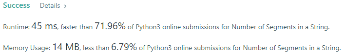

# Daily Leetcode

## 434 - Number of Segments in a String: 11/18/2022

### Problem

Given a string `s`, return _the number of segments in the string_.

A **segment** is defined to be a contiguous sequence of **non-space characters**.

### Assumptions

- There must be a way for the computer to keep track of what is contiguous and what is not.
- The input can be anything, therefore leading and trailing whitespace must be accounted for.

### Optimizations:

Solution is:

- O(n) time: The runtime scales linearly with the size of the input
- O(1) space: No extra space is allocated that cannot be determined at runtime

### Notes

This solution felt optimal but could possibly lean towards brute force. Without the use of built-in functions, I had to think differently when reaching a solution. Remembering that a computer does not know the difference between contiguous, and not, was helpful.

## 223 - Rectangle Area: 11/17/2022

### Problem

Given the coordinates of two **rectilinear** rectangles in a 2D plane, return the _total area covered by the two rectangles_.

The first rectangle is defined by its **bottom-left** corner `(ax1, ay1)` and its **top-right** corner `(ax2, ay2)`.

The second rectangle is defined by its **bottom-left** corner `(bx1, by1)` and its **top-right** corner `(bx2, by2)`.

### Assumptions

- Bottom-left coords are always less than top right coordinates
- There are a limited number of intersection combinations (4)

### Optimizations

Solution is:

- O(1) time: The size of the input is always known at runtime
- O(1) space: No extra space is allocated that cannot be determined at runtime

### Notes

This problem was difficult to understand on a 2D perspective but became clear on a 1D perspective.

Through the four combinations of rectangle coordinates:

- a1-b1-a2-b2
- a1-b1-b2-a2
- b1-a1-b2-a2
- b1-a1-a2-b2

Only the inner two coordinates would reveal the overlap of the input rectangles.

Once the area of the overlap is determined, subtracting the overlap from the sum of the input rectangles gives the final answer.

## 374 - Guess Number Higher or Lower: 11/16/2022

### Problem

I pick a number from 1 to n. You have to guess which number I picked.
Every time you guess wrong, I will tell you whether the number I picked is higher or lower than your guess.
You call a pre-defined API int guess(int num), which returns three possible results:

- -1: Your guess is higher than the number I picked (i.e. num > pick).
- 1: Your guess is lower than the number I picked (i.e. num < pick).
- 0: your guess is equal to the number I picked (i.e. num == pick).

Return the number that I picked.

### Assumptions

- Searching for an unknown number by one number at a time is inefficient.
- Introducing a third number (middle) for comparison will allow us to remove numbers lower or higher than the third number.
- When the unknown number is lower or higher than the middle number, the middle number needs to be shifted as the unknown number cannot equal the middle number.

### Optimizations

Solution is:

- Binary search
- O(log(n)) time: The range of the input is halved each iteration, therefore the runtime is reduced.
- O(1) space: No extra space is allocated that cannot be determined at runtime.

### Notes

_Since_ `pick` _is namespaced,_ `__pick__` _can be used to make the solution O(1) time :wink:_

## 1480 - Running Sum of 1D Array: 11/15/2022

### Problem

Given an array `nums`. We define a running sum of an array as `runningSum[i] = sum(nums[0]…nums[i])`.

Return the running sum of `nums`.

### Assumptions

- An array can be modified in place.
- The first number of the input array does not change, therefore it can be skipped in iteration.
- Indexes 1...n is where the addition takes place, start the iteration at index 1 until index _n_.

### Optimizations

Solution is:

- O(n) time: The loop has to run through each element in the array.
- O(1) space: The array is modified in place and extra space is not created based on the input size.
